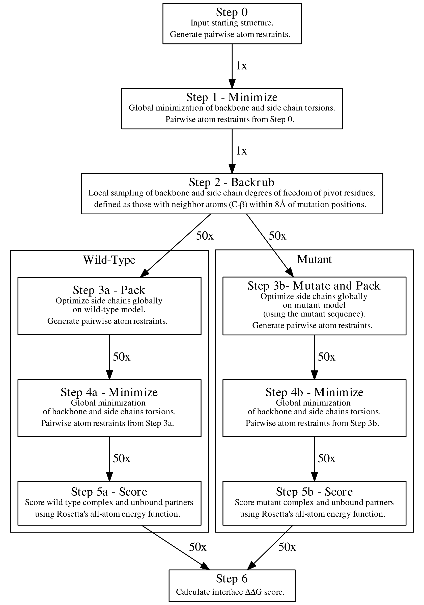

======================
Flex ddG Tutorial
======================

The most up-to-date version of this tutorial `is available on GitHub <https://github.com/Kortemme-Lab/flex_ddG_tutorial>`_.

Introduction
------------

In this activity, you will utilize the Flex ddG [KB2018]_ protocol within Rosetta to computationally model and predict changes in binding free energies upon mutation (interface ΔΔG).

This protocol uses the "backrub" protocol [CS2018]_ implemented in `Rosetta <https://www.rosettacommons.org>`_ to sample conformational diversity.

The flex ddG protocol is outlined below (Fig 1. from [KB2018]_):

Run Flex ddG
^^^^^^^^^^^^

1. From within your downloaded copy of this tutorial, open ``run.py`` in your `editor of choice <https://xkcd.com/1823>`_.
#. Find the ``rosetta_scripts_path`` at the top of ``run.py`` and check that it is set to the appropriate location of your compiled Rosetta rosetta_scripts binary.
#. Run ``python run.py``. The full command line call to each instance of Rosetta will be displayed, and will look something like this:

   ``/home/user/rosetta/source/bin/rosetta_scripts -s /home/user/flex_ddG_tutorial/inputs/1JTG/1JTG_AB.pdb -parser:protocol /home/user/flex_ddG_tutorial/ddG-backrub.xml -parser:script_vars chainstomove=B mutate_resfile_relpath=/home/user/flex_ddG_tutorial/inputs/1JTG/nataa_mutations.resfile number_backrub_trials=10 max_minimization_iter=5 abs_score_convergence_thresh=200.0 backrub_trajectory_stride=5 -restore_talaris_behavior -in:file:fullatom -ignore_unrecognized_res -ignore_zero_occupancy false -ex1 -ex2``

   Important flags explained:

   * ``-ex1 -ex2`` tell Rosetta's side chain packing algorithm to sample extra subrotamers for chi1 and chi2 angles (`Packer documentation <https://www.rosettacommons.org/docs/latest/rosetta_basics/options/packing-options>`_)
   * ``mutate_resfile_relpath=`` is an input file that tells Rosetta which protein positions to mutate in the ddG calculation. The resfile must start with ``NATAA``. See the `Rosetta documentation <https://www.rosettacommons.org/docs/latest/rosetta_basics/file_types/resfiles>`_ for more information on resfiles.
   * ``number_backrub_trials=`` is the number of backrub sampling steps. 35,000 steps gives good performance for a variety of inputs, although it is likely similar performance could be achieved for certain cases with less sampling.
   * ``max_minimization_iter=`` is the maximum number of minimization gradient descent steps to take. 5000 is the normal, benchmarked value.
   * ``abs_score_convergence_thresh=`` is the maximum allowed change in total model score after minimization (comparing initial score to score after minimization). If this change exceeds this threshold, then another minimization cycle will be started.
   * ``backrub_trajectory_stride=`` after every N backrub steps, finish the flex ddG calculations. This allows protocol performance to be judged at intermediate number of backrub sampling steps without running a separate trajectory. In general, this can be set to the same number as ``number_backrub_trials``, but it may be useful for benchmarking purposes to set this at an intermediate value.

#. Output will be saved in a new directory named ``output``

Analysis
--------

In normal usage, you would run the flex ddG protocol 35+ times (at 35,000 backrub steps each run), and average the resulting ddG predictions for best performance. For the purposes of making this tutorial run quickly on an average laptop, we will generate fewer output models for many fewer backrub and minimization steps.

Python analysis
^^^^^^^^^^^^^^^

These Python packages are required in order to run the analysis, and can be installed via pip: ``pip install numpy pandas``.

Run the analysis script as follows:

::

  python analyze_flex_ddG.py output

References
----------

.. [KB2018]
   Kyle A. Barlow, Shane Ó Conchúir, Samuel Thompson, Pooja Suresh, James E. Lucas, Markus Heinonen, and Tanja Kortemme.
   Flex ddG: Rosetta Ensemble-Based Estimation of Changes in Protein–Protein Binding Affinity upon Mutation.
   *J. Phys. Chem. B*,
   February 2018. doi: 10.1021/acs.jpcb.7b11367.
   URL: https://pubs.acs.org/doi/pdf/10.1021/acs.jpcb.7b11367

.. [KB2017]
   Kyle A. Barlow, Shane Ó Conchúir, Samuel Thompson, Pooja Suresh, James E. Lucas, Markus Heinonen, and Tanja Kortemme.
   Flex ddG: Rosetta Ensemble-Based Estimation of Changes in Protein–Protein Binding Affinity upon Mutation.
   *bioRxiv Preprint*,
   November 2017.
   URL: https://www.biorxiv.org/content/early/2017/11/17/221689

.. [CS2008]
    Smith, C. A.; Kortemme, T.
    Backrub-Like Backbone Simulation Recapitulates Natural Protein Conformational Variability and Improves Mutant Side-Chain Prediction.
    *Journal of Molecular Biology*
    2008. DOI:10.1016/j.jmb.2008.05.023.
